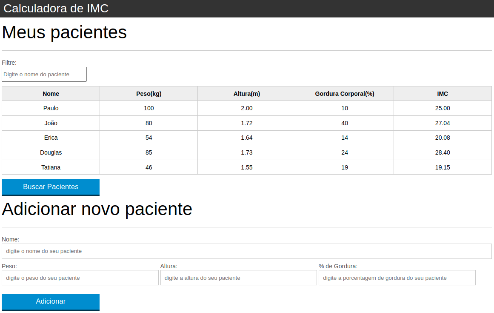

# Calculadora de índice de massa corpórea (IMC)

---

Esse projeto consiste de uma página WEB dinâmica que lista os pacientes de uma API em uma tabela com seus respectivos dados.
Além disso é possível adicionar um novo paciente.

---

Projeto desenvolvido no curso de fundamentos de Javascript da Alura.